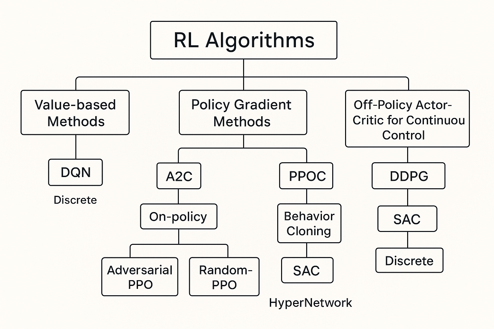

$ RL Methods

---

## **1. Value-Based Methods**

### **DQN (Deep Q-Network)**

* **Type:** Off-policy, value-based.
* **How it works:** Learns a Q-function ( Q(s,a) ) using a neural network. Uses **experience replay** and a **target network** to stabilize training.
* **Pros:**

  * Works well on discrete action spaces.
  * Stable for tasks like Atari games.
* **Cons:**

  * Not suitable for continuous action spaces.
  * Sample inefficient in large state spaces.
* **Use case:** Video games with discrete actions.

---

## **2. Policy Gradient Methods**

### **A2C (Advantage Actor-Critic)**

* **Type:** On-policy, actor-critic.
* **How it works:** Combines a policy network (actor) and a value network (critic). Updates policy using **advantage function**: ( A(s,a) = Q(s,a) - V(s) ).
* **Pros:**

  * Handles both discrete and continuous actions.
  * More stable than vanilla policy gradients.
* **Cons:**

  * On-policy → sample inefficient.
* **Use case:** Robotics simulations, continuous control.

### **PPO (Proximal Policy Optimization)**

* **Type:** On-policy, policy gradient.
* **How it works:** Improves policy with a clipped surrogate objective to prevent large updates:
  [
  L^{CLIP}(\theta) = \mathbb{E}[\min(r(\theta)A, \text{clip}(r(\theta),1-\epsilon,1+\epsilon)A)]
  ]
* **Pros:**

  * Stable, easy to tune.
  * Works for both discrete and continuous actions.
* **Cons:**

  * On-policy → requires lots of interactions.
* **Use case:** Robotics, games, continuous control.

### **Curriculum PPO**

* **Type:** PPO variant.
* **How it works:** Uses **curriculum learning** → gradually increasing task difficulty to improve learning stability.
* **Pros:**

  * Helps in sparse reward tasks.
  * Improves exploration gradually.
* **Cons:**

  * Designing curriculum can be task-specific.
* **Use case:** Complex environments like multi-stage robotics tasks.

### **Adversarial PPO**

* **Type:** PPO variant.
* **How it works:** Adds adversarial perturbations to either policy or environment to improve **robustness**.
* **Pros:**

  * Produces policies resilient to disturbances.
* **Cons:**

  * Training can be more unstable.
* **Use case:** Safety-critical applications, sim-to-real transfer.

### **Random-PPO**

* **Type:** PPO variant.
* **How it works:** Introduces **randomized exploration or perturbations** in the environment or policy to encourage diversity.
* **Pros:**

  * Better exploration in complex environments.
* **Cons:**

  * Less sample-efficient.
* **Use case:** Exploration-heavy tasks.

---

## **3. Off-Policy Actor-Critic for Continuous Control**

### **DDPG (Deep Deterministic Policy Gradient)**

* **Type:** Off-policy, actor-critic.
* **How it works:** Deterministic policy for continuous actions + Q-network. Uses **experience replay** and **target networks**.
* **Pros:**

  * Efficient for continuous action spaces.
  * Works with high-dimensional actions.
* **Cons:**

  * Can be unstable.
  * Sensitive to hyperparameters.
* **Use case:** Robotic arm control, Mujoco simulations.

### **SAC (Soft Actor-Critic)**

* **Type:** Off-policy, actor-critic, entropy-regularized.
* **How it works:** Adds **entropy maximization** to encourage exploration:
  [
  J(\pi) = \mathbb{E}[R + \alpha \mathcal{H}(\pi)]
  ]
* **Pros:**

  * Stable, sample-efficient.
  * Handles continuous actions well.
* **Cons:**

  * Slightly more complex to implement than DDPG.
* **Use case:** Continuous control, multi-objective RL.

---

## **4. Multi-Agent RL / Advanced Extensions**

### **MA-POCA (Multi-Agent Proximal Policy Optimization with Centralized Advantage)**

* **Type:** Multi-agent PPO.
* **How it works:** Centralized training, decentralized execution. Uses **centralized critic** for multi-agent environments.
* **Pros:**

  * Handles multi-agent coordination tasks.
  * Reduces non-stationarity issues.
* **Cons:**

  * Scaling to many agents can be challenging.
* **Use case:** Multi-robot systems, competitive/cooperative games.

---

## **5. Imitation Learning**

### **Behavior Cloning**

* **Type:** Supervised learning imitation.
* **How it works:** Learns policy from **demonstrations** by mimicking expert actions.
* **Pros:**

  * Simple, fast convergence if demos exist.
* **Cons:**

  * Fails if the agent encounters unseen states (no exploration).
* **Use case:** Autonomous driving, expert demonstration replication.

---

## **6. Meta-Learning / Network Augmentation**

### **HyperNetwork**

* **Type:** Neural network that outputs parameters of another network.
* **How it works:** Learns a mapping from **task embedding** to policy or value network parameters.
* **Pros:**

  * Enables fast adaptation to new tasks (meta-RL).
  * Compact representation for multi-task learning.
* **Cons:**

  * Training is complex.
  * Can be memory-intensive.
* **Use case:** Multi-task RL, few-shot adaptation.

---

## **Comparison Table**

| Method               | Type              | On/Off Policy | Action Space | Sample Efficiency | Stability | Special Notes                |
| -------------------- | ----------------- | ------------- | ------------ | ----------------- | --------- | ---------------------------- |
| **DQN**              | Value-based       | Off           | Discrete     | Medium            | Medium    | Classic, Atari games         |
| **A2C**              | Policy gradient   | On            | Both         | Low               | Medium    | Simple actor-critic          |
| **PPO**              | Policy gradient   | On            | Both         | Medium            | High      | Clipped surrogate            |
| **Curriculum PPO**   | PPO variant       | On            | Both         | Medium            | High      | Gradual task difficulty      |
| **Adversarial PPO**  | PPO variant       | On            | Both         | Medium            | Medium    | Robust to perturbations      |
| **Random-PPO**       | PPO variant       | On            | Both         | Medium            | Medium    | Randomized exploration       |
| **DDPG**             | Actor-Critic      | Off           | Continuous   | High              | Low       | Deterministic policy         |
| **SAC**              | Actor-Critic      | Off           | Continuous   | High              | High      | Entropy-regularized          |
| **MA-POCA**          | Multi-Agent PPO   | On            | Both         | Medium            | Medium    | Multi-agent coordination     |
| **Behavior Cloning** | Imitation         | N/A           | Both         | High              | High      | Needs demonstrations         |
| **HyperNetwork**     | Meta-RL / network | N/A           | Both         | High              | Medium    | Fast adaptation to new tasks |

---

✅ **Key Takeaways:**

1. **Discrete vs Continuous:** DQN is only for discrete; DDPG/SAC are for continuous.
2. **On-Policy vs Off-Policy:** On-policy (PPO, A2C) is stable but sample-hungry; off-policy (DQN, DDPG, SAC) is more sample-efficient but can be unstable.
3. **Exploration vs Stability:** SAC and PPO variants often handle exploration and stability better than vanilla DDPG/A2C.
4. **Multi-Agent / Advanced Tasks:** MA-POCA and HyperNetwork target specialized settings like multi-agent or meta-RL.
5. **Imitation Learning:** Behavior cloning is effective with expert data but lacks exploration.

---

Powered by ChatGPT
